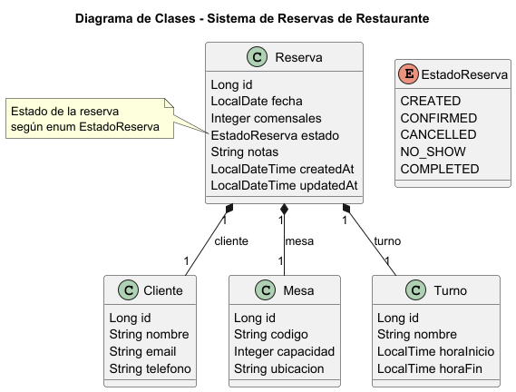
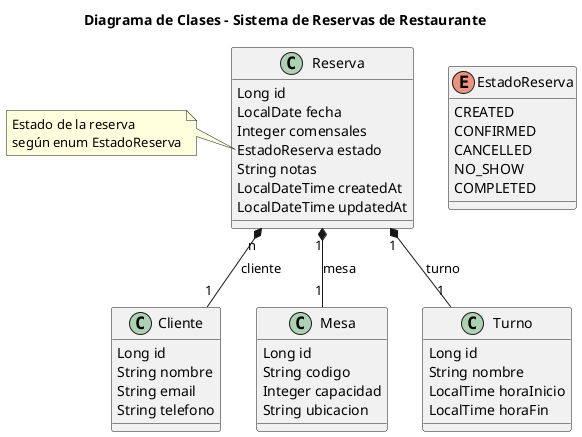
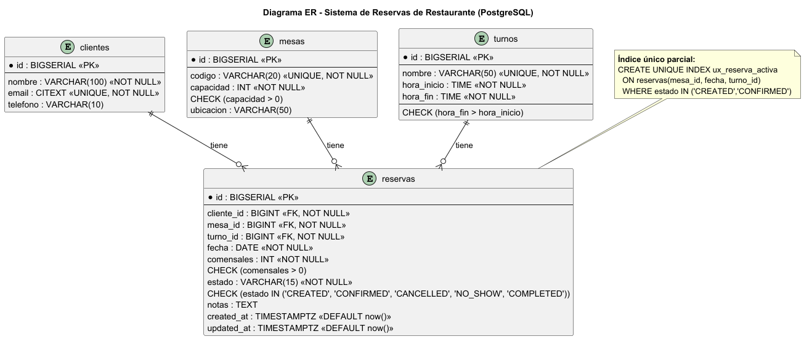

# API de Reservas de Restaurante — POO135 · Ciclo II/2025

> Proyecto para diseñar e implementar una API REST que gestione **reservas de mesas** por **fecha** y **turno** (turnos por hora), validando disponibilidad y capacidad.

- **Estado del proyecto:** Entrega 1 (diseño, sin código de backend)
Tutor GT03:
Ing. Francisco Javier Morales Ayala

Integrantes

- Emerson Arístides Alam Álvarez Figueroa AF97011 
- Héctor Danilo Benítez Ortéz BO16004
- Samuel Timoteo Cortez Hernández CH21024
- Rodrigo Ernesto García Portillo GP24005
- Marlon Alexis Núñez Ramos NR24002
- Jonás Eduardo Villalobos Moran VM24042


---

## 🧭 Índice
- [Objetivo de la Entrega 1](#objetivo-de-la-entrega-1)
- [Alcance de la Entrega 1](#alcance-de-la-entrega-1)
- [Reglas de Negocio](#reglas-de-negocio)
- [Modelo de Dominio (UML)](#modelo-de-dominio-uml)
- [Modelo ER (PostgreSQL)](#modelo-er-postgresql)
- [Casos de Uso + Criterios de Aceptación](#casos-de-uso--criterios-de-aceptación)
- [Próximas entregas (placeholder)](#próximas-entregas-placeholder)

---

## Objetivo de la Entrega 1
Documentar el **diseño funcional y de datos** del sistema:
- Reglas de negocio claras.
- **UML** de clases del dominio.
- **ER** de base de datos (ajustado a PostgreSQL).
- Casos de uso con **criterios de aceptación**.

> No incluye código; la implementación llega en la Entrega 2.

---

## Alcance de la Entrega 1
 - Incluye crear reserva, consultar disponibilidad, confirmar/cancelar (definidos a nivel de diseño)
 - No incluye autenticación, pagos, notificaciones ni reservas por hora exacta (solo por turnos) o reportes.

---

## Reglas de Negocio

### Reservas
- **RN-01** Una mesa **no puede** tener **más de una reserva activa** (`CREATED`/`CONFIRMED`) para la **misma fecha** y **mismo turno**.
- **RN-02** `comensales ≤ capacidad` de la mesa.
- **RN-03** No se aceptan reservas con **fecha en el pasado**.
- **RN-04** Deben existir **cliente, mesa y turno**.
- **RN-05** Estados: `CREATED`, `CONFIRMED`, `CANCELLED`, `NO_SHOW`, `COMPLETED`.
- **RN-06** Solo `CREATED` o `CONFIRMED` cuentan como **activas** para la validación de choques.

### Mesas
- **RN-07** Cada mesa debe tener un **identificador único** (`mesaId`).
- **RN-08** La **capacidad mínima es 1** y debe ser un **número entero positivo**.
- **RN-09** Una mesa **no puede cambiar su capacidad** si tiene reservas **activas** (para no invalidar las existentes).
- **RN-10** Una mesa puede estar **disponible en múltiples turnos y fechas**, salvo cuando tenga reservas activas.

### Clientes
- **RN-11** Cada cliente debe tener un **identificador único** (`clienteId`).
- **RN-12** El cliente debe registrar como mínimo: **nombre y teléfono** (`email` opcional).
- **RN-13** Un cliente puede tener **múltiples reservas** en distintas mesas, fechas o turnos.

### Turnos
- **RN-14** Cada turno debe tener un **identificador único** (`turnoId`).
- **RN-15** Un turno debe tener **nombre** (ejemplo: `"turno 1"`) y un **rango horario válido** (ejemplo: `08:00 – 08:59`).
- **RN-16** No se permiten turnos que se **solapen en horario** (ejemplo: `12:00 – 15:00` y `14:00 – 16:00`).
- **RN-17** Solo se puede reservar en **turnos definidos previamente**.


---

## Modelo de Dominio (UML)
Diagrama:


> PlantUML.



---

## Modelo ER (PostgreSQL)
Diagrama:  


Puntos clave:
- `clientes(email)` como **CITEXT UNIQUE** (case-insensitive).
- `mesas(codigo)` **UNIQUE**.
- `turnos(nombre)` **UNIQUE**; `hora_fin > hora_inicio`.
- `reservas` con `fecha: DATE`, `created_at/updated_at: TIMESTAMPTZ`.

**Índice único parcial (disponibilidad):**
```sql
CREATE UNIQUE INDEX ux_reserva_activa
  ON reservas(mesa_id, fecha, turno_id)
  WHERE estado IN ('CREATED','CONFIRMED');
```

---

## Casos de Uso + Criterios de Aceptación

### CU-001 Crear Reserva
**Entrada:** `clienteId, mesaId, turnoId, fecha, comensales, notas?`  
**Flujo:** validar existencia (RN-04) → fecha (RN-03) → capacidad (RN-02) → disponibilidad (RN-01) → crear `CREATED`.  
**Errores:** `404` inexistentes, `400` fecha/capacidad, `409` mesa ocupada.

### CU-002 Consultar Disponibilidad
**Entrada:** `fecha, turnoId, capacidadMin?`  
**Flujo:** Validar `turnoId` → listar mesas **sin** reservas activas para `(fecha, turno)`(RN-01/06) → filtrar por `capacidadMin` → Devolver lista.
**Errores:** `404` Inexistente.

### CU-003 Confirmar / Cancelar
**Entrada:** `reservaId`  
**Flujo:** buscar → actualizar `estado` (`CONFIRMED`/`CANCELLED`) → `updatedAt`.
**Errores:** `404` Inexistente, `422` Transición inválida.

### CU-004 Marcar No-Show
**Entrada:** `reservaUD`
**Flujo:** Verificar `estado`(`CONFIRMED`) → disponibilidad → Actualizar `estado`(`NO_SHOW`) → `updatedAt`.
**Errores:** `404` Inexistente, `422` Transición inválida.

### CU-005 Completar reserva
**Entrada:** `reservaUD`
**Flujo:** Validar atencion → actualizar `estado` (`COMPLETED`) → `updatedAt`.
**Errores:** `404` Inexistente, `422` Transición inválida.

### CU-006 Reprogramar Reserva
**Entrada:** `reservaId, nuevaFecha, nuevoTurnoId, nuevaMesaId`  
**Flujo:** Verificar existencia `reservaId` → Verificar existencia de recursos (RN-04) → Validar fecha (RN-03) → capacidad (RN-02) → disponibilidad (RN-06) → `updatedAt`.
**Errores:** `404` Inexistente,  `400` fecha/capacidad, `409` mesa ocupada.

### CU-007 Ver Detalle de Reserva
**Entrada:** `reservaId`
**Flujo:** Buscar `reservaId` → Devolver `cliente, mesa, turno, fecha, comensales, estado, notas`
**Errores:** `404` Inexistente.

### CU-008 Listar Reservas
**Entrada:** `fecha, turnoId`
**Flujo:** Buscar por `fecha, turnoId` → Aplicar filtros y orden Desc → Devolver pagina con totales.
**Errores:** `404` Inexistente.

### CU-009 Eliminar Reserva 
**Entrada:** `reservaId`
**Flujo:** Verificar `estado`(`CREATED`) → actualizar `estado` (`CANCELLED`) → Eliminar
**Errores:** `404` Inexistente, `422` Transición inválida.

### CU-010 Registrar Cliente
**Entrada:** `nombre, telefono, email`
**Flujo:** Validar formato `telefono, email` → Verificar unicidad `telefono`(Unico) → Crear cliente → Devolver `clienteId`.
**Errores:** `400` Datos invalidos, `409` Dato duplicado.

### CU-011 Actualizar Cliente 
**Entrada:** `clienteId, nombre, telefono, email`
**Flujo:** Verificar existencia `clienteId` → Validar nuevos datos → Verificar unicidad `telefono` → Guardar cambios `updatedAt` 
**Errores:** `400` Datos invalidos, `409` Dato duplicado.

### CU-011 Eliminar Cliente
**Entrada:** `clienteId`
**Flujo:** Verificar `clienteId` → Verificar reservas activas → Eliminar
**Errores:** `400` Datos invalidos, `409` Conflicto de estado.

### CU-012 Lista Clientes
**Entrada:** `clienteId`
**Flujo:** Verificar `clienteId` → Ordear alfabeticamente desc → Devolver resultados
**Errores:** `400` Datos invalidos.

### CU-013 Registrar Mesa
**Entrada:** `codigo, capacidad, ubicacion?`
**Flujo:** Validar unicidad `codigo` → Crear mesa
**Errores:** `400` Capacidad,  `409` Duplicado.

### CU-014 Actualizar Mesa
**Entrada:** `mesaId, capacidad, ubicacion?`
**Flujo:** Validar existencia `mesaId` → Verificar capacidad/ afeccion a reservas → Guardar cambios `updatedAt`. 
**Errores:** `404` Inexistente, `409` Capacidad invalida.

### CU-015 Eliminar Mesa
**Entrada:** `mesaId`
**Flujo:** Buscar `mesaId` → Verificar referencia a reservas → Eliminar
**Errores:** `404` Inexistente, `409` Conflicto por referencias.

### CU-016 Listar Mesa
**Entrada:** `capacidadMin?, activa?`
**Flujo:** Listar mesas → Aplicar filtros → Devolver paginado
**Errores:** `404` Inexistente.

### CU-017 Registrar Turno
**Entrada:** `nombre, horaInicio, horaFin`
**Flujo:** Validar rango horario → Verificar que no haya conflicto → Crear turno
**Errores:** `400` Datos invalidos,  `409` Conflicto.

### CU-018 Actualizar Turno
**Entrada:** `turnoId, nombre?, horaInicio?, horaFin?`
**Flujo:** Validar existencia `turnoId` → Validar nuevo rango → Guardar cambios `updatedAt`.
**Errores:** `400` Rango invalido, `409` Conflicto.

### CU-019 Desactivar Turno
**Entrada:** `turnoId`
**Flujo:** Buscar `turnoId` → Comprobar conflictos con reservas → Eliminar Turno
**Errores:** `404` Inexistente, `409` Conflicto.

### CU-020 Listar Turno
**Entrada:** `turnoId,soloActivos?`
**Flujo:** Buscar por `turnoId` → Filtrar solo activos → Devolver turnos 
**Errores:** `404` Inexistente. 


### Casos de Aplicación (CA)

- **CA-01:** Dado una mesa de capacidad 4 y un turno 8:00 - 8:59 el 2025-10-01 sin reservas, cuando creo una reserva por 4 comensales para esa mesa, fecha y turno, entonces la reserva se crea en `CREATED`.
- **CA-02:** Dado una reserva activa existente para la mesa con `Mesa M-01`, 2025-10-01, Turno 9:00 - 9:59 , cuando intento crear otra para los mismos (mesa, fecha, turno), entonces recibo **409 Conflict** y no se crea una segunda reserva.
- **CA-03:** Dado una mesa de capacidad 2, cuando intento reservar 3 comensales, entonces recibo **400 Bad Request** por capacidad excedida.
- **CA-04:** Dado la fecha de ayer, cuando intento reservar para ayer, entonces recibo **400 Bad Request** por fecha en el pasado.
- **CA-05:** Dado fecha 2025-10-01 y turno 11:00 - 11:59, cuando consulto disponibilidad, entonces veo **todas las mesas sin reserva activa** para ese (fecha, turno).
- **CA-06:** Dado que `clienteId = 9999`, `mesaId = 9999` o `turnoId = 9999` no existen, cuando intento crear una reserva, recibo **404 Not Found** detallando la entidad y la reserva no se crea.
- **CA-07:** Dada una reserva existente con estado `CREATED`, al realizar una solicitud para confirmarla (`CONFIRMED`) o cancelarla (`CANCELLED`) su estado cambia al estado solicitado (`CONFIRMED/CANCELLED`)
- **CA-08:** Dada una reserva en estado `CANCELLED`, al intentar confirmarla (Actualizarla a CONFIRMED),  entonces recibo **400 Bad Request** o **422 Unprocessable Entity**
- **CA-09:** Dada una reserva `CONFIRMED` para la mesa con `id = 05`, Turno 9:00 - 9:59, Fecha 2025-11-15, al reprogramar para Turno 8:00 - 8:59, Fecha 2025-11-15 (Con Turno disponible = True), la reserva se actualiza correctamente.
- **CA-10:** Dada una reserva `CONFIRMED` para la mesa  `Mesa M-01`, Turno 11:00 - 11:59, Fecha 2025-11-15, al reprogramar otra reserva (O a si misma) para los mismos valores, entonces recibo **409 Conclict** y la reprogramacion no se realiza. 
- **CA-11:** Dada una resreva para 4 comensales para la mesa `Mesa M-03` con Capacidad de 5 personas, cuando intento cambiar a la mesa `Mesa M-06` con Capacidad para 3 personas, entonces recibo **400 Bad Request** por capacidad insuficiente.
- **CA-12:** Dada una reserva en estado `CREATED` para `reservaId = 124`, al solicitar su eliminacion, entonces la reserva se elimina exitosamente.
- **CA-13:** Dada una reserva en estado `CONFIRMED` para `reservaId = 574`, cuando solicito su eliminacion, entonces recibo **409 Conflict** o **422 Unprocessable Entity** y está no se elimina.
- **CA-14:** Dado que la mesa con  `Mesa M-01` existe, al intentar crear otra mesa con el mismo código, entonces recibo **409 Conflict** y la nueva mesa no se crea.
- **CA-15:** Dada la mesa `Mesa M-16` con capacidad 5 y con una reserva activa para 5 comensales, cuando intento modificar la capacidad de `M-16` a 4, recibo **409 Conflict** y la capacidad no cambia.
- **CA-16:** Dada la mesa `Mesa M-19` con capacidad 3 y su reserva activa maxima de 3 comensales, cuando intento modificar la capacidad de `M-19`a 4, entonces la capacidad se actualiza.
- **CA-17:** Dada la mesa `Mesa M-81` al no tener reservas activas, cuando se solicita su eliminacion, entonces la mesa es eliminada con exito. De lo contrario recibo **409 Conflict** y la mesa no se elimina.
- **CA-18:** Dado el `Cliente C-154` ya registrado con `télefono: 8457-5132`, al intentar crear un nuevo `Cliente C-155` con el mismo télefono, recibo **409 Conflict** y el nuevo cliente no se registra.
- **CA-19:** Dado el `Cliente C-54` con `télefono: 5216-5421`, al intentar actualizar el telefono a un valor ya utilizado por con `C-71` entonces recibo **409 Conflict** y el télefono de `C-54` no cambia.
- **CA-20:** Dado el `Cliente C-62` que tiene una reserva activa (`CONFIRMED`), cuando intento eliminarlo, recibo **409 Conflict** y el cliente no es eliminado.
- **CA-21:** Dado el `Cliente C-73` que tiene solo reservas historicas (`COMPLETED`), al solicitar su desactivacion, entonces la operacion se realiza con exito.
- **CA-22:** Dado que un turno llamado "Tarde" no existe, al crear un turno con `nombre:Tarde, horaInicio: 14:00, horaFin: 18:00`, entonces el turno se crea con exito.
- **CA-23:** Dado que `Turno Almuerzo` existe (`12:00 - 14:00`) cuando intento crear un nuevo turno con `nombre: Almuerzo, horaInicio: 12:00`, entonces recibo **409 Conflict** por nombre duplicado.
- **CA-24:** Cuando intento crear un turno con `horaInicio: 20:00, horaFin: 19:00`, entonces recibo **400 Bad Request** por rango horario inválido.
- **CA-25:** Dado `Turno X` (`17:00 - 19:00`), cuanto intenro crear `Turno Y` (`18:00 - 20:00`), que solapa al existente, entonces recibo **409 Conflict** por solapamiento de horarios y el turno no se crea.
- **CA-26:** Dado el `Turno Cena`(`19:00 - 23:00`), cuando lo actualizo a `horaFin: 22:00` (manteniendo un rango valido), entonces se actualiza con exito.
- **CA-27:**  Dado el `Turno Cena`(`19:00 - 23:00`) y el `Turno Noche`(`23:00 - 01:00`), cuando actualizo `Turno Cena` a `horaFin: 23:30`, entonces recibo **409 Conflict** (Por solapamiento) y la actualizacion no se realiza.
- **CA-28:** Dado un `Turno Noche` que no tiene reservas activas o futuras que lo referencien, cuando se solicita su eliminacion, entonces la operacion sucede con exito.
- **CA-29:** Dado un `Turno Noche` inexistente, cuando el usuario intenta crear una reserva para ese turno, entonces la operacion es rechazada y recibo **404 Not Found** o **409 Conflict**.
- **CA-30:** Dada la lista completa de turnos (activos e inactivos), cuando listo los turnos con el filtro agrupar por `horaInicio = desc`, recibo la lista de turnos de forma descendente.


## 🚀 Guía de Implementación y Despliegue (Fase 2 y 3)

Esta sección documenta los requisitos técnicos para la ejecución y validación del proyecto, cumpliendo con los criterios de la entrega final.

### ⚙️ Requisitos del Entorno
- **Java:** JDK 17 o superior.
- **Base de Datos:** PostgreSQL (Puerto `5432`).
- **Gestión de Dependencias:** Maven Wrapper (incluido en el proyecto).

### 📥 Instalación y Ejecución

**1. Preparación de la Base de Datos**
El proyecto conecta a una base de datos local. Ejecuta el siguiente script en tu cliente PostgreSQL (PgAdmin o terminal):
```sql
CREATE DATABASE prueba_api;
```
*(Nota: Editar configuración para la conexión a base de datos, editar `spring.datasource.url`, `spring.datasource.username` y `spring.datasource.username.password` `src/main/resources/application.properties`) con los correspondientes de la base de datos.*

**2. Compilación y Ejecución de la API**
Desde la terminal en la raíz del proyecto:

* **En Windows (PowerShell/CMD):**
    ```powershell
    ./mvnw.cmd spring-boot:run
    ```
* **En Linux / Mac:**
    ```bash
    ./mvnw spring-boot:run
    ```

Una vez iniciado, el servicio estará disponible en: `http://localhost:8080`.

**3. Ejecución de Pruebas Unitarias (JUnit)**
Para validar la lógica de negocio y la robustez del código:
```bash
./mvnw test
```

---

## 📡 Documentación de Endpoints (Ejemplos JSON)

A continuación se detallan los payloads necesarios para probar la funcionalidad completa en **Postman**.

### 👤 Gestión de Clientes
**Registrar Nuevo Cliente**
- **Método:** `POST`
- **URL:** `http://localhost:8080/api/clientes`
```json
{
  "nombre": "Juan Pérez",
  "email": "juan.perez@ejemplo.com",
  "telefono": "7070-1234"
}
```

### 🍽️ Gestión de Mesas
**Registrar Nueva Mesa**
- **Método:** `POST`
- **URL:** `http://localhost:8080/api/mesas`
```json
{
  "codigo": "M-05",
  "capacidad": 4,
  "ubicacion": "Terraza - Vista Jardin"
}
```

### ⏰ Gestión de Turnos
**Registrar Turno Operativo**
- **Método:** `POST`
- **URL:** `http://localhost:8080/api/turnos`
```json
{
  "nombre": "Cena Turno 1",
  "horaInicio": "18:00",
  "horaFin": "19:59"
}
```

### 📅 Gestión de Reservas (Core del Negocio)

**1. Crear Reserva (Estado Inicial: CREATED)**
Valida disponibilidad de mesa y capacidad (RN-01, RN-02).
- **Método:** `POST`
- **URL:** `http://localhost:8080/api/reservas`
```json
{
  "fecha": "2025-12-01",
  "clienteId": 1,
  "mesaId": 1,
  "turnoId": 1,
  "comensales": 4
}
```

**2. Confirmar Reserva**
Transición de estado: `CREATED` -> `CONFIRMED`.
- **Método:** `POST`
- **URL:** `http://localhost:8080/api/reservas/{id}/confirmar`
- **Body:** *(Vacío)*

**3. Cancelar Reserva**
Transición de estado: `CREATED/CONFIRMED` -> `CANCELLED`.
- **Método:** `POST`
- **URL:** `http://localhost:8080/api/reservas/{id}/cancelar`
- **Body:** *(Vacío)*

---

### 🛡️ Manejo de Errores y Códigos de Estado
La API implementa un manejo de excepciones para garantizar respuestas consistentes:

| Código HTTP | Significado | Causa Común |
|---|---|---|
| **200 OK / 201 Created** | Éxito | Operación realizada correctamente. |
| **400 Bad Request** | Error de Validación | Datos incorrectos, fecha en pasado, capacidad excedida. |
| **404 Not Found** | No Encontrado | ID de Cliente, Mesa o Turno no existe en BD. |
| **409 Conflict** | Conflicto de Negocio | La mesa ya está reservada en ese horario (Solapamiento). |
| **500 Internal Server Error** | Error Crítico | Fallo inesperado del servidor. |
