# API de Reservas de Restaurante — POO135 · Ciclo II/2025

> Proyecto para diseñar e implementar una API REST que gestione **reservas de mesas** por **fecha** y **turno** (turnos por hora), validando disponibilidad y capacidad.

- **Estado del proyecto:** Entrega 1 (diseño, sin código de backend)
Tutor GT03:
Ing. Francisco Javier Morales Ayala

Integrantes

- Emerson Arístides Alam Álvarez Figueroa AF97011 
- Héctor Danilo Benítez Ortéz BO16004
- Samuel Timoteo Cortez Hernández CH21024
- Rodrigo Ernesto García Portillo GP24005
- Marlon Alexis Núñez Ramos NR24002
- Jonás Eduardo Villalobos Moran VM24042


---

## 🧭 Índice
- [Objetivo de la Entrega 1](#objetivo-de-la-entrega-1)
- [Alcance de la Entrega 1](#alcance-de-la-entrega-1)
- [Reglas de Negocio](#reglas-de-negocio)
- [Modelo de Dominio (UML)](#modelo-de-dominio-uml)
- [Modelo ER (PostgreSQL)](#modelo-er-postgresql)
- [Casos de Uso + Criterios de Aceptación](#casos-de-uso--criterios-de-aceptación)
- [Próximas entregas (placeholder)](#próximas-entregas-placeholder)

---

## Objetivo de la Entrega 1
Documentar el **diseño funcional y de datos** del sistema:
- Reglas de negocio claras.
- **UML** de clases del dominio.
- **ER** de base de datos (ajustado a PostgreSQL).
- Casos de uso con **criterios de aceptación**.

> No incluye código; la implementación llega en la Entrega 2.

---

## Alcance de la Entrega 1
 - Incluye crear reserva, consultar disponibilidad, confirmar/cancelar (definidos a nivel de diseño)
 - No incluye autenticación, pagos, notificaciones ni reservas por hora exacta (solo por turnos) o reportes.

---

## Reglas de Negocio
- **RN-01** Una mesa **no puede** tener **más de una reserva activa** (estados `CREATED`/`CONFIRMED`) para la **misma fecha** y **mismo turno**.
- **RN-02** `comensales ≤ capacidad` de la mesa.
- **RN-03** No se aceptan reservas con **fecha en el pasado**.
- **RN-04** Deben existir **cliente, mesa y turno**.
- **RN-05** Estados: `CREATED`, `CONFIRMED`, `CANCELLED`, `NO_SHOW`, `COMPLETED`.
- **RN-06** Solo `CREATED` o `CONFIRMED` cuentan como activas para la validación de choques.

---

## Modelo de Dominio (UML)
Diagrama:


> PlantUML.

```plantuml
@startuml
title Diagrama de Clases - Sistema de Reservas de Restaurante

class Cliente {
  Long id
  String nombre
  String email
  String telefono
}

class Mesa {
  Long id
  String codigo
  Integer capacidad
  String ubicacion
}

class Turno {
  Long id
  String nombre
  LocalTime horaInicio
  LocalTime horaFin
}

enum EstadoReserva {
  CREATED
  CONFIRMED
  CANCELLED
  NO_SHOW
  COMPLETED
}

class Reserva {
  Long id
  LocalDate fecha
  Integer comensales
  EstadoReserva estado
  String notas
  LocalDateTime createdAt
  LocalDateTime updatedAt
}

Reserva "n" *-- "1" Cliente : cliente
Reserva "1" *-- "1" Mesa : mesa
Reserva "1" *-- "1" Turno : turno

note left of Reserva::estado
  Estado de la reserva
  según enum EstadoReserva
end note
@enduml
```



---

## Modelo ER (PostgreSQL)
Diagrama:  


Puntos clave:
- `clientes(email)` como **CITEXT UNIQUE** (case-insensitive).
- `mesas(codigo)` **UNIQUE**.
- `turnos(nombre)` **UNIQUE**; `hora_fin > hora_inicio`.
- `reservas` con `fecha: DATE`, `created_at/updated_at: TIMESTAMPTZ`.

**Índice único parcial (disponibilidad):**
```sql
CREATE UNIQUE INDEX ux_reserva_activa
  ON reservas(mesa_id, fecha, turno_id)
  WHERE estado IN ('CREATED','CONFIRMED');
```

---

## Casos de Uso + Criterios de Aceptación

### CU-001 Crear Reserva
**Entrada:** `clienteId, mesaId, turnoId, fecha, comensales, notas?`  
**Flujo:** validar existencia (RN-04) → fecha (RN-03) → capacidad (RN-02) → disponibilidad (RN-01) → crear `CREATED`.  
**Errores:** `404` inexistentes, `400` fecha/capacidad, `409` mesa ocupada.

### CU-002 Consultar Disponibilidad
**Entrada:** `fecha, turnoId, capacidadMin?`  
**Flujo:** Validar `turnoId` → listar mesas **sin** reservas activas para `(fecha, turno)`(RN-01/06) → filtrar por `capacidadMin` → Devolver lista.
**Errores:** `404` Inexistente.

### CU-003 Confirmar / Cancelar
**Entrada:** `reservaId`  
**Flujo:** buscar → actualizar `estado` (`CONFIRMED`/`CANCELLED`) → `updatedAt`.
**Errores:** `404` Inexistente, `422` Transición inválida.

### CU-004 Marcar No-Show
**Entrada:** `reservaUD`
**Flujo:** Verificar `estado`(`CONFIRMED`) → disponibilidad → Actualizar `estado`(`NO_SHOW`) → `updatedAt`.
**Errores:** `404` Inexistente, `422` Transición inválida.

### CU-005 Completar reserva
**Entrada:** `reservaUD`
**Flujo:** Validar atencion → actualizar `estado` (`COMPLETED`) → `updatedAt`.
**Errores:** `404` Inexistente, `422` Transición inválida.

### CU-006 Reprogramar Reserva
**Entrada:** `reservaId, nuevaFecha, nuevoTurnoId, nuevaMesaId`  
**Flujo:** Verificar existencia `reservaId` → Verificar existencia de recursos (RN-04) → Validar fecha (RN-03) → capacidad (RN-02) → disponibilidad (RN-06) → `updatedAt`.
**Errores:** `404` Inexistente,  `400` fecha/capacidad, `409` mesa ocupada.

### CU-007 Ver Detalle de Reserva
**Entrada:** `reservaId`
**Flujo:** Buscar `reservaId` → Devolver `cliente, mesa, turno, fecha, comensales, estado, notas`
**Errores:** `404` Inexistente.

### CU-008 Listar Reservas
**Entrada:** `fecha, turnoId`
**Flujo:** Buscar por `fecha, turnoId` → Aplicar filtros y orden Desc → Devolver pagina con totales.
**Errores:** `404` Inexistente.

### CU-009 Eliminar Reserva 
**Entrada:** `reservaId`
**Flujo:** Verificar `estado`(`CREATED`) → actualizar `estado` (`CANCELLED`) → Eliminar
**Errores:** `404` Inexistente, `422` Transición inválida.

### CU-010 Registrar Cliente
**Entrada:** `nombre, telefono, email`
**Flujo:** Validar formato `telefono, email` → Verificar unicidad `telefono`(Unico) → Crear cliente → Devolver `clienteId`.
**Errores:** `400` Datos invalidos, `409` Dato duplicado.

### CU-011 Actualizar Cliente 
**Entrada:** `clienteId, nombre, telefono, email`
**Flujo:** Verificar existencia `clienteId` → Validar nuevos datos → Verificar unicidad `telefono` → Guardar cambios `updatedAt` 
**Errores:** `400` Datos invalidos, `409` Dato duplicado.

### CU-011 Eliminar Cliente
**Entrada:** `clienteId`
**Flujo:** Verificar `clienteId` → Verificar reservas activas → Eliminar
**Errores:** `400` Datos invalidos, `409` Conflicto de estado.

### CU-012 Lista Clientes
**Entrada:** `clienteId`
**Flujo:** Verificar `clienteId` → Ordear alfabeticamente desc → Devolver resultados
**Errores:** `400` Datos invalidos.

### CU-013 Registrar Mesa
**Entrada:** `codigo, capacidad, ubicacion?`
**Flujo:** Validar unicidad `codigo` → Crear mesa
**Errores:** `400` Capacidad,  `409` Duplicado.

### CU-014 Actualizar Mesa
**Entrada:** `mesaId, capacidad, ubicacion?`
**Flujo:** Validar existencia `mesaId` → Verificar capacidad/ afeccion a reservas → Guardar cambios `updatedAt`. 
**Errores:** `404` Inexistente, `409` Capacidad invalida.

### CU-015 Eliminar Mesa
**Entrada:** `mesaId`
**Flujo:** Buscar `mesaId` → Verificar referencia a reservas → Eliminar
**Errores:** `404` Inexistente, `409` Conflicto por referencias.

### CU-016 Listar Mesa
**Entrada:** `capacidadMin?, activa?`
**Flujo:** Listar mesas → Aplicar filtros → Devolver paginado
**Errores:** `404` Inexistente.

### CU-017 Registrar Turno
**Entrada:** `nombre, horaInicio, horaFin`
**Flujo:** Validar rango horario → Verificar que no haya conflicto → Crear turno
**Errores:** `400` Datos invalidos,  `409` Conflicto.

### CU-018 Actualizar Turno
**Entrada:** `turnoId, nombre?, horaInicio?, horaFin?`
**Flujo:** Validar existencia `turnoId` → Validar nuevo rango → Guardar cambios `updatedAt`.
**Errores:** `400` Rango invalido, `409` Conflicto.

### CU-019 Desactivar Turno
**Entrada:** `turnoId`
**Flujo:** Buscar `turnoId` → Comprobar conflictos con reservas → Eliminar Turno
**Errores:** `404` Inexistente, `409` Conflicto.

### CU-020 Listar Turno
**Entrada:** `turnoId,soloActivos?`
**Flujo:** Buscar por `turnoId` → Filtrar solo activos → Devolver turnos 
**Errores:** `404` Inexistente. 


### Casos de Aplicación (CA)

- **CA-01:** Dado una mesa de capacidad 4 y un turno 8:00 - 8:59 el 2025-10-01 sin reservas, cuando creo una reserva por 4 comensales para esa mesa, fecha y turno, entonces la reserva se crea en `CREATED`.
- **CA-02:** Dado una reserva activa existente para Mesa M-01, 2025-10-01, Turno 9:00 - 9:59 , cuando intento crear otra para los mismos (mesa, fecha, turno), entonces recibo **409 Conflict** y no se crea una segunda reserva.
- **CA-03:** Dado una mesa de capacidad 2, cuando intento reservar 3 comensales, entonces recibo **400 Bad Request** por capacidad excedida.
- **CA-04:** Dado la fecha de ayer, cuando intento reservar para ayer, entonces recibo **400 Bad Request** por fecha en el pasado.
- **CA-05:** Dado fecha 2025-10-01 y turno 11:00 - 11:59, cuando consulto disponibilidad, entonces veo **todas las mesas sin reserva activa** para ese (fecha, turno).
- **CA-06:** Dado que ClienteID = 9999, MesaID = 9999 o TurnoID = 9999 no existen, cuando intento crear una reserva, recibo **404 Not Found** detallando la entidad y la reserva no se crea.
- **CA-07:** Dada una reserva existente con estado CREATED, al realizar una solicitud para confirmarla (CONFIRMED) o cancelarla (CANCELLED) su estado cambia al estado solicitado (CONFIRMED/CANCELLED)
- **CA-08:** Dada una reserva en estado CANCELLED, al intentar confirmarla (Actualizarla a CONFIRMED),  entonces recibo **400 Bad Request** o **422 Unprocessable Entity**
- **CA-09:** Dada una reserva CONFIRMED para la mesa con ID 05, Turno 9:00 - 9:59, Fecha 2025-11-15, al reprogramar para Turno 8:00 - 8:59, Fecha 2025-11-15 (Con Turno disponible = True), la reserva se actualiza correctamente.
- **CA-10:** Dada una reserva CONFIRMED para la mesa con ID 27, Turno 11:00 - 11:59, Fecha 2025-11-15, al reprogramar otra reserva (O a si misma) para los mismos valores, entonces recibo **409 Conclict** y la reprogramacion no se realiza. 


---

## Próximas entregas (placeholder)
- **Entrega 2 (Implementación):** Spring Boot + JPA + Flyway + controladores + validaciones + Postman.  
- **Entrega 3 (Pruebas y robustez):** Manejo de errores global, tests JUnit/WebMvcTest, documentación final.
